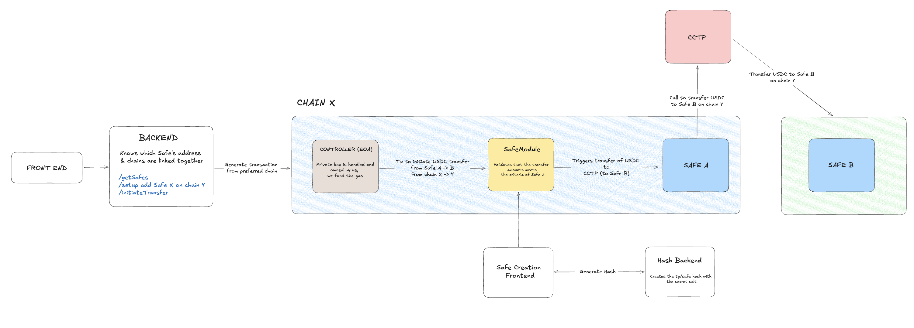

# Mini Safe

Mini Safe is your friendly team multisig wallet integrated on Telegram for simplifying P2P payments.

## Description

Mini Safe is the Revolut Team Business of Web3, where you and your team members can interact with a team multisig wallet directly on Telegram, with a monthly spendable amount (starting at $1,000 for no approval required). We are using Telegram to improve user experience and create mass adoption for multisig wallets, then we want to be secured using a spendable amount.

> This project has been built during ETHGlobal Singapore. More information [here](https://ethglobal.com/events/singapore2024).

- Watch the demo video and project page here 👉 [video](LINK)
- Open the live demo here 👉 [video](https://t.me/MiniSafeBot)

## Mini Telegram App Architecture

## Key features

1️⃣ Interact with a Telegram bot and a mini Telegram app

2️⃣ Onboarding new members with Safe module

3️⃣ Start spending on different apps or send money to another Telegram ID / ENS

4️⃣ Cross-chain payments using CCTP (Cross-Chain Transfer Protocol)

5️⃣ Verification system using Dynamic

6️⃣ Granular Security

7️⃣ Telegram Notification System

8️⃣ Multisig Invitations by Telegram Roles

9️⃣ Gasless onboarding

🔟 Social Recovery

## What you can do with Mini Safe as a user?

As a team member

- Access Request to pay invoices
- Create Payment links for people to claim
- Access Bitrefill to buy gift cards for Airbnb, Flight, VPN…
- Send funds to GnosisPay

As an individual

- Send gifts to your contributors or to onboard frens
- Change DeFi position in emergency
- ETHGlobal staking

## Deployed modules

(testnet)

- Linea: [0x62352FfDadC4081192A0dc9F34DC57A5C9b2D3ee](https://sepolia.lineascan.build/address/0x62352FfDadC4081192A0dc9F34DC57A5C9b2D3ee)
- Base: [0x62352FfDadC4081192A0dc9F34DC57A5C9b2D3ee](https://sepolia.basescan.org/address/0x62352ffdadc4081192a0dc9f34dc57a5c9b2d3ee)

- Flow: 0x8b6707989467773db58cc10701f33351f4a34697b00ec3e88c007b969cb73c67

## Contributors

- Mathis Sergent: [@mathissrgt](https://github.com/mathisrgt)
- Baptiste Florentin: [@pybast](https://github.com/Pybast)
- Solène Daviaud: [@sdaav](https://github.com/sdaav)
